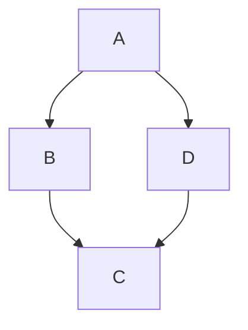

EXPLICACIÓN GIT:

EL primer paso que hice Fue entrar en la carpeta donde guardo mis boletines de JAVA, que será la carpeta que conecte a mi repositorio;

Si no tienes ninguna carpeta creada puedes crearla con el comando

mkdir NombreDeLaCarpeta

En mi caso la llamé Boletines, y accedí a ella con 

cd Boletines

una vez dentro empecé de 0 con GIT, creando mi usuario y mi correo:

git config --global user.name "Tu Nombre"

git config --global user.email "Tu Gmail"

Tras hacer esto pongo este pequeño comando para que no me ande a pedir la contraseña cada ve que quiero subir un archivo

git config --global credential.helper 'cache --timeout=36000'

JEJE de esta manera hasta dentro de 36000 Segundos no me la volverá a pedir

El siguiente paso es inicializar GIT con el siguiente comando

git init

Tras inicializarlo he creado el Archivo README.md  (si vosotros habeis creado el repositorio de github con este archivo este paso os lo podeis saltar llendo a vuestro repositorio y haciendo un git clone y listo, pero yo os recomiendo que no lo hagais)

echo "Hola Mundo">>README.md

Bien Tras tener el archivo README.md hay que decirle a git que lo vamos a querer subir

git add README.md

tras hacer esto, debemos hacer nuestro primer commit (que es hacer un screenshot de la version actual)

git commit -m "Escribe un comentario"

El siguiente paso será conectar nuestra carpeta con el repositorio que hemos creado en github

git remote add origin https:\\el link de vuestro repositorio

comprobamos que esta bien conectado con

git remote -v

y lo siguiente que nos quedaría sería crear un TOKEN en github para poder subir nuestros archivos, una vez creado haremso el push

git push origin main

nos pedira nuestro usuario de github
y de contraseña debemos pegar el TOKEN

!!LISTO PROCESO COMPLETADO¡¡

más adelante, cuando hemos creado nuestro programa y tenemos una versión final tenemos que crear una etiqueta 

esta se crea poniendo git tag -a v1.0 -m "comento que he creado la version 1.0"

para hacer el git push de la tag hay que poner

git push origin --tags

